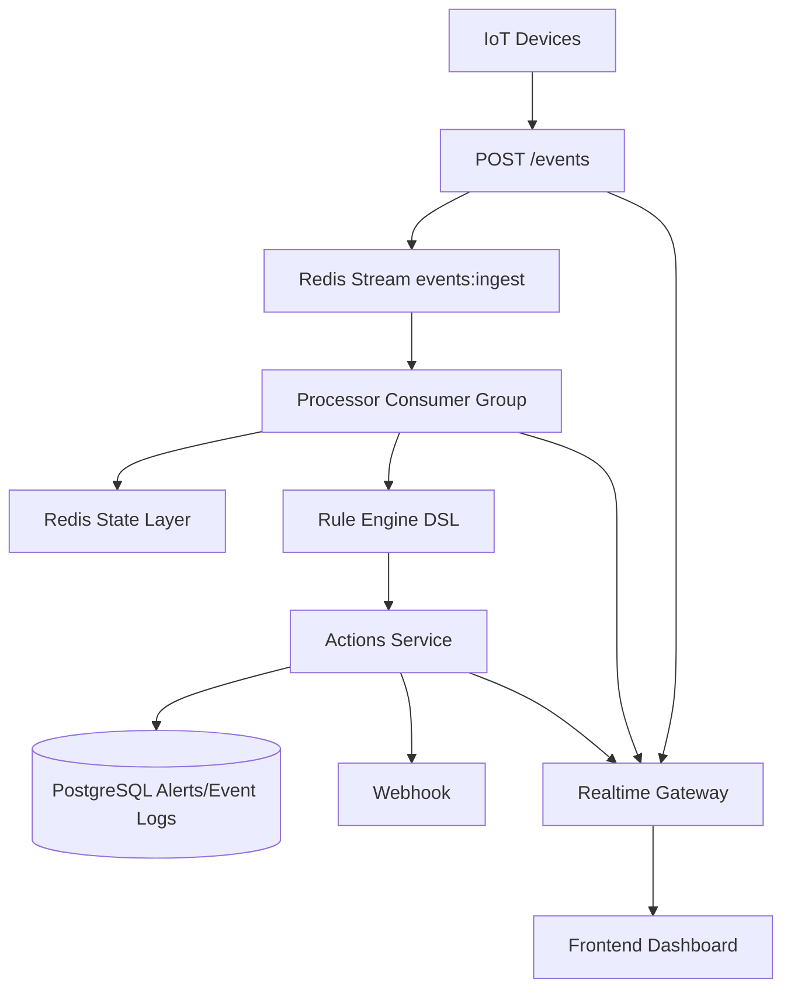

# Smart Facility Backend

Real-time event processing backend for industrial IoT using NestJS, Redis Streams, Redis state, PostgreSQL (Supabase), and Socket.io.

## Architecture Diagram



## Core Modules

- `ingestion`: authenticated event ingestion endpoint
- `stream`: Redis Streams producer and consumer-group config
- `processor`: async stream consumer with dedupe, ordering policy, rule execution
- `state`: Redis sorted-set windows, last-seen, and last-event timestamp state
- `rule-engine`: dynamic JSON DSL evaluation
- `actions`: alert creation, webhook retry, idempotency
- `rules`: CRUD for dynamic rules
- `alerts`: CRUD/listing for manual or triggered alerts
- `realtime`: Socket.io live updates (`event.received`, `event.processed`, `event.dropped`, `alert.created`, `device.status`)

## Rule DSL Examples

Threshold + consecutive:

```json
{
  "operator": ">",
  "threshold": 70,
  "window": { "type": "count", "value": 3 },
  "action": "ALERT"
}
```

Time-window spikes:

```json
{
  "operator": ">",
  "threshold": 50,
  "window": { "type": "time", "value": 10 },
  "minMatches": 3,
  "action": "ALERT"
}
```

Heartbeat missing:

```json
{
  "operator": "missing",
  "window": { "type": "time", "value": 30 },
  "action": "ALERT"
}
```

## Edge Case Strategy

- **Duplicate events**: Redis `SET NX EX` key dedupe (`dedupe:event:*`)
- **Out-of-order events**: accepted within tolerance window; stale events beyond `120s` are dropped and emitted as `event.dropped`
- **Delayed events**: handled by sorted-set timestamp ordering; very stale events are skipped for graceful degradation
- **Idempotent alerts**: unique `dedupeKey` in `Alert` table

## Webhook Policy

- timeout: 3s
- retries: 3
- backoff: 1s -> 2s -> 4s

## Horizontal Scaling

- Processor uses Redis Stream consumer group `event-processors`
- Multiple worker instances can run in parallel safely
- `XACK` after processing guarantees work partitioning and backpressure-friendly decoupling

## Setup

1. Install dependencies:
   - `npm install`
2. Set `.env`:
   - `DATABASE_URL` (pooler URI)
   - `DIRECT_URL` (direct URI for Prisma CLI)
   - `REDIS_URL`, `API_KEY`, optional `WEBHOOK_URL`
3. Create schema:
   - `npx prisma db push`
4. Run app:
   - `npm run start:dev`

## API

- `POST /events`
- `POST /rules`, `GET /rules`, `GET /rules/:id`, `PATCH /rules/:id`, `DELETE /rules/:id`
- `POST /alerts`, `GET /alerts`, `GET /alerts/:id`, `DELETE /alerts/:id`

## Postman

Import files:
- `postman/smart-facility.postman_collection.json`
- `postman/local.postman_environment.json`

## Load Test

- `npm run load:test`

Optional environment overrides:
- `LOAD_TEST_URL`
- `LOAD_TEST_API_KEY`
- `LOAD_TEST_DURATION`
- `LOAD_TEST_CONNECTIONS`

## Trade-offs

- Redis Streams chosen over Kafka for assignment scope and faster local setup
- Prisma + Supabase gives fast iteration; schema changes are straightforward
- Rule engine is JSON-DSL based for extensibility; currently optimized for threshold/time/count/heartbeat patterns
- Event ordering policy prefers throughput + resilience over strict global ordering
