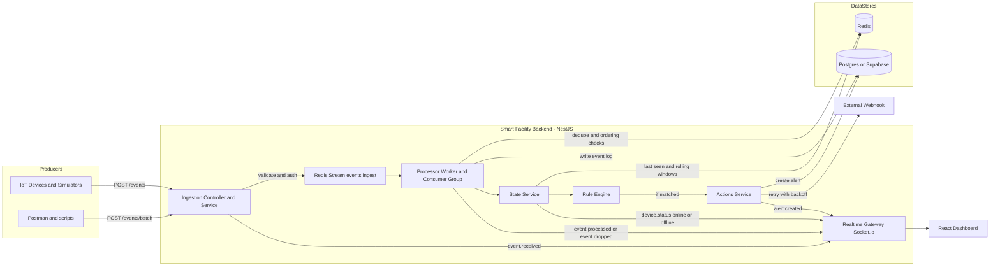

# Smart Facility Submission Docs

This folder contains assignment-ready documentation and API artifacts.

## Architecture Diagram (must-have)

## Key Decisions and Trade-offs

- **NestJS modular architecture**
  - Decision: split by domain (`ingestion`, `processor`, `rules`, `alerts`, `realtime`, etc.).
  - Trade-off: more files and wiring, but cleaner ownership and testability.

- **Redis Streams for ingestion queue**
  - Decision: decouple API write path from processing using consumer groups.
  - Trade-off: operational dependency on Redis; if Redis is unavailable, stream-based flow is degraded.

- **Redis for hot state + Postgres for durable records**
  - Decision: keep high-churn state in Redis, durable entities/events in Postgres.
  - Trade-off: dual-storage consistency complexity, but better performance for rule windows.

- **JSON DSL for rule definitions**
  - Decision: rules configurable at runtime via database JSON.
  - Trade-off: requires stronger validation and careful versioning of rule schema.

- **Realtime via Socket.io**
  - Decision: emit domain events (`event.received`, `event.processed`, `alert.created`, `device.status`) for dashboard UX.
  - Trade-off: additional connection management and event contract maintenance.

- **POST fallback for updates (`/rules/:id/update`)**
  - Decision: support POST update route in addition to PATCH for easier browser/CORS and client compatibility.
  - Trade-off: less strictly RESTful, but simpler integration across tools.

## Included in this folder

- `README.md` (this file)
- `api/API_DOCS.md`
- `api/smart-facility.postman_collection.json`
- `api/local.postman_environment.json`

## Quick Run

1. Start infra: `docker compose up -d redis postgres`
2. Start backend in `smart-facility-backend`: `npm run start:dev`
3. Use Postman files from `submission-docs/api`
